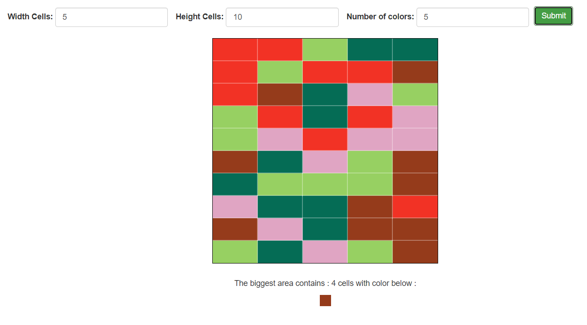

## Connected Colored Cells

### Input the fields and get results, you can also look into the code

### 2D array can't be defined in JS, that's the crunch here

### Clone or download and open index.html and see the magic.